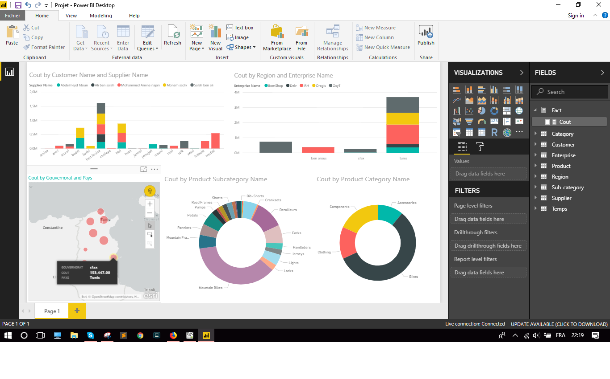

# Sales-cube
SSAS project

### Schema


### MDX Queries

TOP 3 Proucts
```
select [Measures].[Cout]
on columns,
non empty
TOPCOUNT( [Product].[Mode
l Name].members,3,
[Measures].[Cout]) on rows
from [sales_esp] ;
```
Revenue By Country
```
select [Measures].[Cout]
on columns,
--non empty
[Region].[Pays].members
on rows
from [sales_esp] ;
```
Revenue Pourcentage By Product 
```
with member measures.tot as
IIF(([Measures].[Cout],[Product].[Product])=0,
null,
[Measures].[Cout] /
 ([Measures].[Cout],[Product].[Product])
 ), FORMAT_STRING ="PERCENT"

select {[Measures].[Cout],[Measures].[tot]} on columns,
		non empty [Product].[Product Name].members on rows
from sales_hy;
```

### Dashbords


