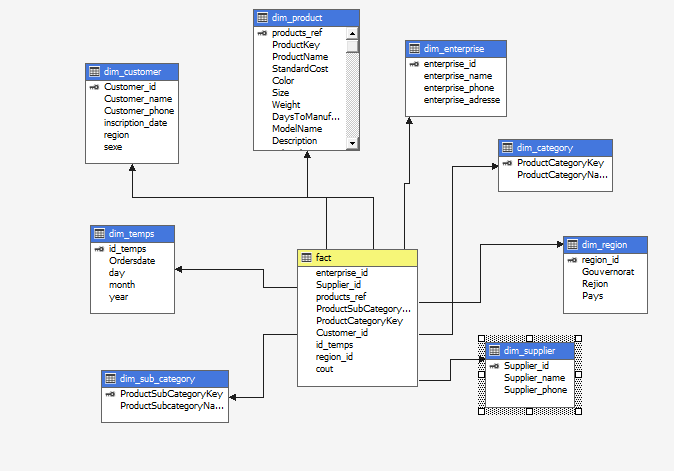

# Sales-cube
SSAS project

### Schema



### MDX Queries

TOP 3 Proucts
```
select [Measures].[Cout]
on columns,
non empty
TOPCOUNT( [Product].[Mode
l Name].members,3,
[Measures].[Cout]) on rows
from [sales_esp] ;
```
Revenue By Country
```
select [Measures].[Cout]
on columns,
--non empty
[Region].[Pays].members
on rows
from [sales_esp] ;
```

### Dashbords


